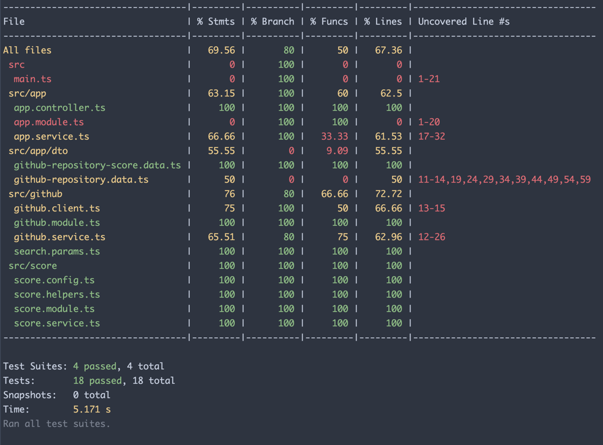

# Popular Github Repo

## How to run

```shell
npm install

# run in development mode
npm run start:dev

# check test coverage
npm test && npm run test:e2e && npm run test:cov

# run in production mode
npm build && npm start
```

## Test endpoint

1. Browse http://localhost:3000/api to test api through OpenAPI/Swagger UI or
2. Direct API access http://localhost:3000/v1/repositories?language=typescript&created=2024-03-01

## Design Decision

Though this is not a very big project, but I tried to keep the code base moduler (monolith). I choose NestJS over express
because it follows micro-module/modular-monolith approach. This approach also helps to migrate to microservice architecture
easily when requires. Apart from that it requires less boilerplate and custom configurations.

There are three modules so far:
- app: Application layer, API, DTO etc.
- github: Client library to fetch GitHub content using GitHUB REST API
- score: Score module only contains logic and configuration related to popularity score calculation

## Score Calculation Algorithm

Since this is a 6 hours task, I kept it simple and straight forward with basic weight based scoring.
There are four factors I have considered to determine the popularity score.

1. starsWeight
2. forksWeight
3. recencyDeviationWeight (when last updated)
4. lifespanDeviationWeight (time window between created and updated datetime)

```javascript
const deviationBasedOnDaysLastUpdated = daysFromLastUpdated * recencyDeviationWeight;
const deviationBasedOnLifespan = daysBetweenCreatedAndUpdated * lifespanDeviationWeight;
const score = (starsCount * starsWeight + forksCount * forksWeight) / (deviationBasedOnDaysLastUpdated * deviationBasedOnLifespan)
```

There are a lot of place we can improve the scoring algorithm. I found it is better to follow some existing algorithm which
are being used in recommendation engines.

## Improvements

1. Implement authentication and authorization
2. Scoring algorithm
3. Improve test coverage


